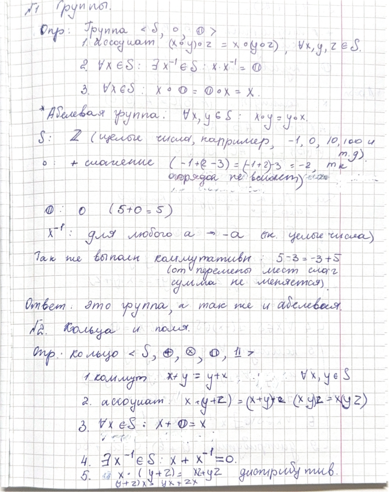
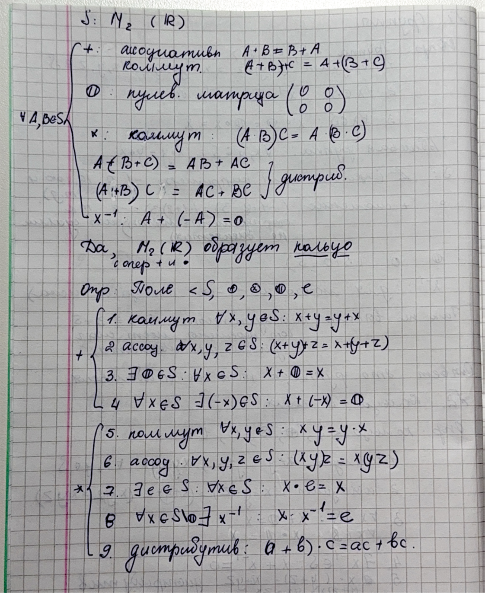
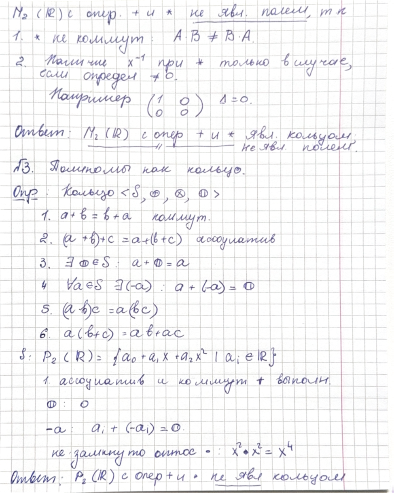
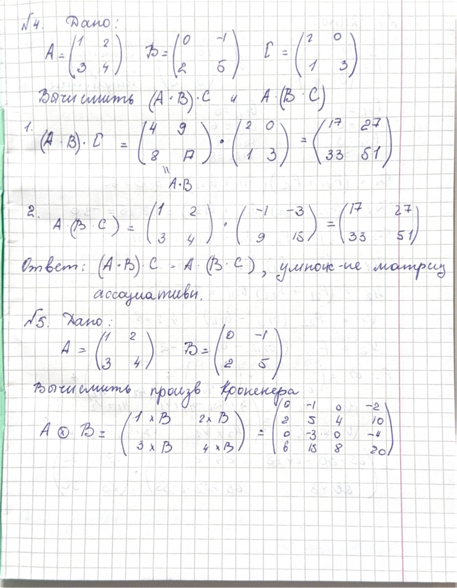
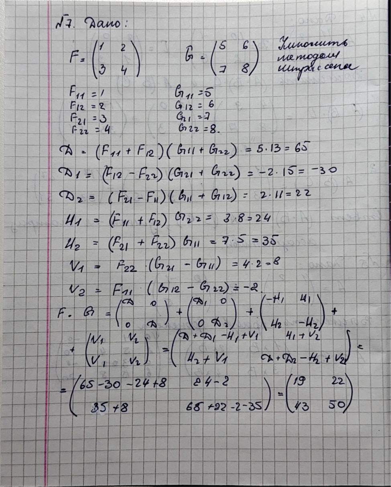
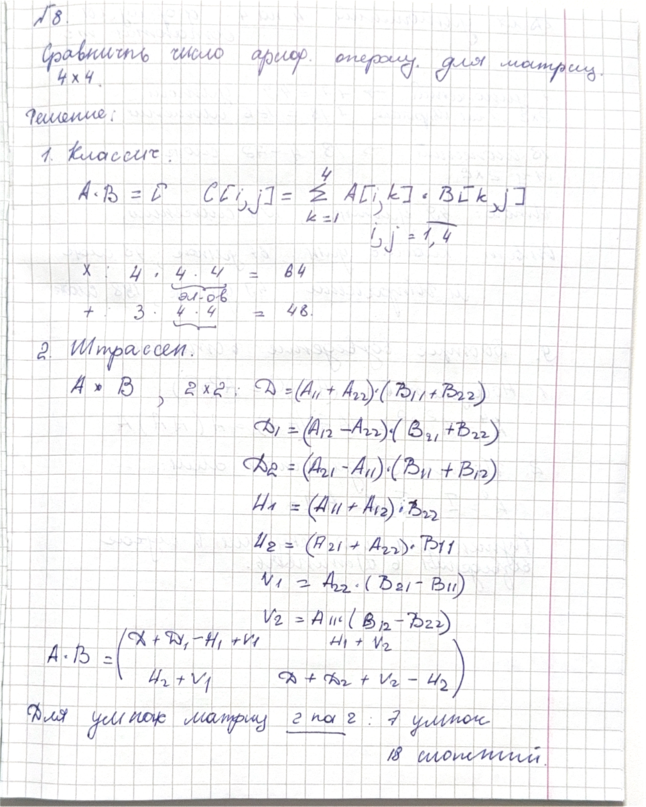
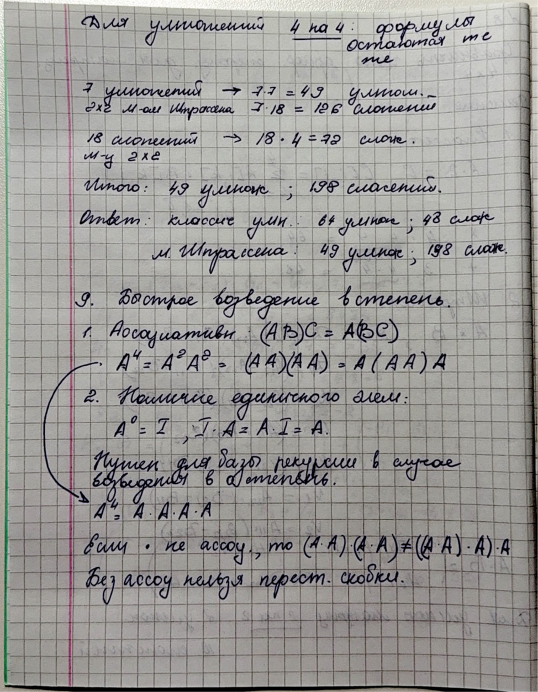

Савинова М. Г. 506701
# Задача 1. Линейная алгебра
## Алгебраические структуры
1.	Группы ✔️ (сделано)
2.	Кольца и поля ✔️
3.	Полиномы как кольцо ✔️

## Операции с матрицами
4.	Умножение матриц ✔️
5.	Умножение Кронекера ✔️

## Теория быстрого умножения матриц
7.	Алгоритм Штрассена ✔️
8.	Сравнение сложности ✔️
9.	Быстрое возведение в степень ✔️

